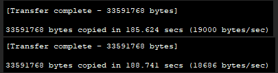
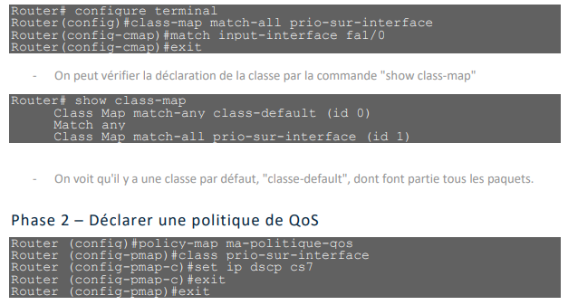
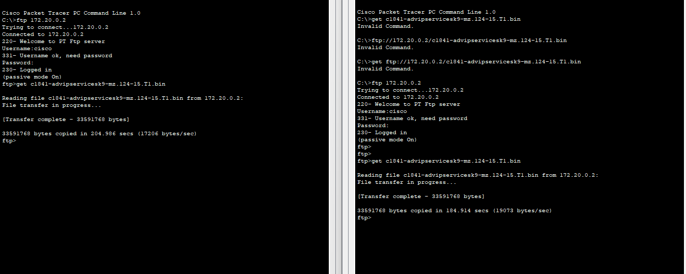
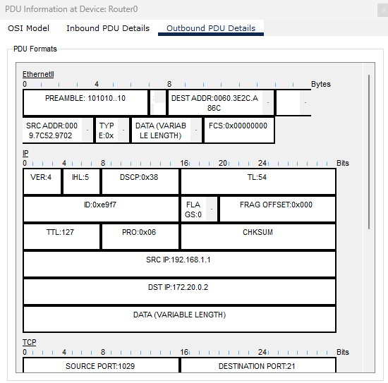
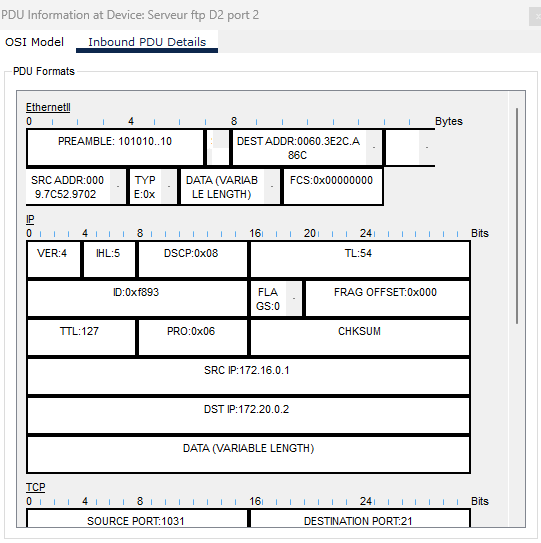

# QOS

## sans QoS

- Quels débits avez-vous relevé ?

  

- Les deux débits sont-ils identiques ? Pourquoi ?

*Les débits sont identiques car il n'y à pas de priorisation*

## QoS activé en fonction de l'interface source

- Quels débits avez-vous relevé ?

  
- Les deux débits sont-ils identiques ? Pourquoi ?

*On vois une différence de débit car il envoie en priorité les paquets a l'interface du routeur qui est priorisé"

- En mode "simulation", à partir du poste H1, retrouver le code DSCP correspondant au paquet
arrivant dans le routeur par le port Fa1/0 et sortant par le port Fa0/1

- Idem pour les paquets arrivant par le port Fa0/0 depuis le poste G1 et sortant par le port Fa0/1

